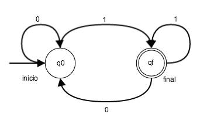

# Introducción a Teoría de la Computación.

> Apuntes del libro de *Michael Sipser*.

Partes:
   1. AUTOMATA
   2. COMPUTABILIDAD
   3. COMPLEJIDAD

---

# Parte I: AUTOMATA

## 1. Lenguajes Regulares

### 1.1 Automata Finito (FA)

Un *Automata finito* es una 5-tupla (Q, &Sigma;, &delta;, q0, F), donde:
   1. Q conjunto de posibles estados.
   2. &Sigma; conjunto finito de acciones *alfabeto*.
   3. &delta;: Q x &Sigma; &rarr; Q 
   4. q0 &isinv; Q: estado inicial.
   5. F &sube; Q: el conjunto de estados de aceptación.

una maquina *M* lee un **string** ó conjunto de elementos del alfabeto *&omega;* &isinv; &Sigma;, los procesa siguiendo las reglas definidas por &delta; y retorna un estado final qf. Si qf &isinv; F, entonces decimos que la máquina **acepta** a &omega;.

Decimios que *M* acepta &omega; si existe una secuencia de estados r1,..., rn en Q tal que:
   1. r0=q0
   2. &delta;(ri,&omega;i+1)=ri+1
   3. rn &sube; F

Definicion *lenguaje de maquina*: Sea A el conjunto de todos los strings que la máquina *M* reconoce/acepta, entonces decimos que **A es el lenguaje de M** y lo notamos: A = L(*M*)

Definición de *lenguaje regular*: Un lenguaje es **regular** si existe un automata finito que lo reconoce.

#### Operaciones regulares:

Sean A y B lenguajes, definimos las siguientes opraciones:
1. *union* (A &xcup; B)={x | x &isinv; A ó x &isinv; B}
2. *concatenacion* (A &cir; B) = {xy| x &isinv; A e y &isinv; B}
3. *star* A&sstarf;={x1,x2,...,xk|k>0 y cada xi&isinv;A}

Teorema: La clase de lenguajes regulares es cerrado en la unión y conecatenación.

### 1.2 Automata Finito No-determinístico (NFA)

Un *Automata finito no determinístico (NFA)* es una 5-tupla (Q, &Sigma;, &delta;, q0, F), donde:
   1. Q conjunto de posibles estados.
   2. &Sigma; conjunto finito de acciones *alfabeto*.
   3. &delta;: Q x &Sigma; &rarr; P(Q) 
   4. q0 &isinv; Q: estado inicial.
   5. F &sube; Q: el conjunto de estados de aceptación.

Teorema de equivalencia entre NFA y Automata finito (DFA): todo NFA tiene un equivalente DFA.

### 1.3 Expresiones Regulares:

Definición: Decimos que R es una **expresión regular** si:
   1. R es a &isinv; &Sigma;
   2. R es &epsilon; 
   3. R es &empty;
   4. R = (R1 &xcup; R2), donde R1 y R2 son regex
   5. R = (R1 &cir; R2),  donde R1 y R2 son regex
   6. R = R1&sstarf;, donde R1 es regex.

Teorema de equivalencia con automata finito: un lenguaje es regular si solo si es descrito por una expresión regular.

##### Automata Finito No-determinístico generalizado (GNFA)
Un *Automata finito no determinístico generalizado (GNFA)* es una 5-tupla (Q, &Sigma;, &delta;, q0, F), donde:
   1. Q conjunto de posibles estados.
   2. &Sigma; conjunto finito de acciones *alfabeto*.
   3. &delta;: (Q-qacept) x (Q - q0) &rarr; R 
   4. q0 &isinv; Q: estado inicial.
   5. F &sube; Q: el conjunto de estados de aceptación.

### 1.4 Lenguajes no-regulares
Todos los lenguajes regulares tienen la siguiente propiedad:

**Teorema del bombeo**: Sea L un lenguaje regular. Entonces existe un entero p&geq;1 ("longitud de bombeo") tal que cualquier cadena w&isinv;L, de longitud &geq;p, puede ser escrita como w = xyz (p. ej. dividiendo w en tres sub-strings), de forma que se satisfacen las siguientes condiciones:
1. |y| &geq; 1 
2. |xy| &leq; p 
3. &forall; i&geq;0: xyiz&isinv;L 

donde **y** es el sub-string que puede ser "bombeada" (borrada o repetida un número i de veces como se indica en (3), y el substring resultante seguirá perteneciendo a L. (1) significa que el string y que se bombea debe tener como mínimo longitud uno. (2) significa que y debe estar dentro de los p primeros caracteres. No hay restricciones acerca de x ó z. 

Una forma de encontrar lenguajes no regulares es buscando que no cumplan las propiedades del teorema del bombeo, por ejemplo:
A = { 0n1n | n&geq;0}

---
## 2. Lenguajes de contexto libre

### 2.1 Gramática de contexto libre

Una gramática consiste en una colección de **reglas de sustitución** (también llamadas **producciones*). Cada regla aparece como una linea en la gramática, por ejemplo:

A &rarr; 0A1 
A &rarr; B   
B &rarr; #

Una gramática de contexto libre (CFG, **context-free grammar**) es una 4-tupla( V, &Sigma;, R, S):
   1. V es un conjunto finito de *variables*.
   2. &Sigma; es un conjunto finito disjunto de V, llamados *terminales*
   3. R es un conjunto de reglas las cuales contienen Variables y Terminales.
   4. S&isinv;V es una variable de inicio.

##### Ambiguedad
Aveces una gramática puede generar el mismo string de formas distintas, cuando esto pasa decimos que la gramática es **ambigua**.

#### Forma normal de Chomsky:
Un CFG está en la **forma normal de Chmosky** si cada regla tiene la forma:
A &rarr;BC
A &rarr;a

donde a es un terminal, y A, B y C son variables.

### 2.2. Push-Down Automata (PDA) 

Son parecidos a automatas no deterministicos, pero agregan un componente llamado *stack*, que provee memoria adicional. Esto hace posible que reconozca algunos lenguajes que no son regulares.

Definición: Un PDA es una 6-tupla (Q, &Sigma;, &Gamma;, &delta;, q0,F) donde:
   1. Q es el conjunto finito de estados.
   2. &Sigma; es un conjunto finito de inputs (alfabeto).
   3. &Gamma; es un conjunto finito de alphabetos, llamado *stack*.
   4. &delta;: Q x &Sigma;&epsilon; x &Gamma;&epsilon; &rarr; P(Q x &Gamma;&epsilon;) es la función de transición.
   5. q0 &isinv; Q es el estado inicial.
   6. F &sube; Q es el conjunto de estados de aceptación.

Teorema de equivalencia: Un lenguaje es libre de contexto si y solo si existe un PDA que lo reconozca.

### 2.3 Lenguajes no-libres de contexto

### 2.4 Lenguajes libres de contexto deterministicos

--- 
# Parte II: COMPUTABILIDAD

## 3. La tesis de Church-Turing

### 3.1 Máquinas de Turing (MT)

Son modelos de computo similares a los automatas, pero de capacidad ilimitada de memoria. Una máquina de Turing hace todo lo que una computadora puede.

Una MT usa una cinta infinita como memoria, y constiene un "cabezal" sobre la cinta que es capaz de leer, moverese y escribir sobre ella.

La cinta tiene el string de entrada escrita y luego todos espacios vaciós (&blank;) alrededor. El cabezal comienza leyendo el primer elemento del string, y siguiendo las reglas definidas de transición puede: no modificar nada/borrar/escribir otro caractér en su lugar y luego moverse al siguiente caracter de la derecha (R) ó izquierda (L). Luego continúa leyendo el proximo caractér y así sucesivamente. 

Definición formal: Una Máquina de Turing es una 7-tupla (Q,&Sigma;,&Gamma;, &delta;,q0, qacept,qreject) donde:
   1. Q es un conjunto de estados. 
   2. &Sigma; es el alfabeto de entradas (no incluye el simbolo &blank; blanco/vacío).
   3. &Gamma; es el alfabeto de la cinta donde &blank; &isinv;&Gamma; y &Sigma; &sube; &Gamma;
   4. &delta;: Q x &Sigma; &rarr; Q x &Sigma; x {L,R} es la función de transición.
   5. q0&isinv;Q es el estado inicial.
   6. qacept&isinv;Q es el estado de aceptación.
   7. qreject&isinv;Q es el estado de rechazo (no puede ser igual a qacept).

Decimos que un lenguaje es **Turing-reconocible** si alguna MT puede reconocerlo.

Cuando una maquina de turing se ejecuta un string de entrada, los resultados posibles pueden ser: **aceptarlo** (si entra al estado qacept), **rechazarlo** (si entra al estado qreject), **loppear infinitamente** nunca llega a un estado final. 

Llamamos **decididores** a las MT que siempre llegan a un estado final (*halt*), es decir que no loopean infinitamente para ningún input. Cuando una MT decididora reconoce un lenguaje decimos que **decide sobre el lenguaje**.

Definicion: un lenguaje es **Turing-decidible** si existe una MT que lo decide.

### 3.2. Variantes de Máquinas de Turing
Se han propuesto MT con distintas características tales como *MT multi-cinta* ó *MT no deterministas* y todas estas resultaron tener la misma capacidad de computo que la MT simple. 

Teorema de equivalencia: Para toda MT multi-cinta existe una MT equivalente.

Teorema de equivalencia: Para toda MT no determinista existe una MT equivalente.

Llamamos *enumeradores* a MT que además incorporan un "dispositivo de salida". Si el enumerador decide, entonces el string de salida decimos que es enumerado por el enumerador.

Teorema: Un lenguaje es Turin-reconocible si y solo si algún enumerador lo enumera.

### 3.3. Definición de algorítmo

Informalmente hablando, un **algoritmo** (también llamados **procedimientos** ó **recetas**) es una colección de instrucciones que llevan a cabo una tarea. 

La *tesis de Church-Turing* da una definición formal a la idea de algorítmo basada en el sistema de notación **&lambda;-calculus** que resultó equivalente a la definición de Máquina de Turing. Por lo tanto, un algortímo es lo mismo que un algorítmo en el contexto de las máquinas de Turing.

---
## 4. Decidibilidad

### 4.1. Lenguajes decidibles

#### Problemas decidibles que involucran lenguajes regulares
ADFA = { &lang;B,&omega;&rang; | B es un DFA que acepta el string &omega;}
Teorema: ADFA es un lenguaje decidible.

ANFA = { &lang;B,&omega;&rang; | B es un NFA que acepta el string &omega;}
Teorema: ADFA es un lenguaje decidible.

EDFA = { &lang;A&rang; | A es DFA y L(A)=&empty;}
Teorema: EDFA es un lenguaje decidible.

EQDFA = { &lang;A,B&rang; | A y B son DFA y L(A)=L(B)}
Teorema: EQDFA es un lenguaje decidible.

#### Problemas decidibles que involucran Gramática de contexto libre

ACFG = { &lang;G,&omega;&rang; | G es CFG que genera &omega;}
Teorema: ACFG es un lenguaje decidible.

ECFG = { &lang;G&rang; | A es CFG y L(G)=&empty;}
Teorema: ECFG es un lenguaje decidible.

EQCFG = { &lang;G,H&rang; | G y H son CFG y L(G)=L(H)}
Teorema: Todo lenguaje libre de contexto es decidible.

### 4.2. Indecidibilidad
ATM = { &lang;M,&omega;&rang; | M es TM que acepta &omega;}

Teorema de indecidibilidad: ATM es indecidible. (Le prueba involucra el uso de el Método de Diagonalización de Cantor)

---
## 5. Reducibilidad

La *reducción* es unaforma de convertr un probema en otro de forma tal que la solución al nuevo problema pueda ser utilizada para resolver el primero.

La reducidibilidad juega un rol central en la clasificación de problemas por decidibilidad, así también como en complejidad.

### 5.1. Problemas indecidibles de teoría del lenguaje

Considere el prolema de la "parada" (**the halting problem**):

HALTTM = { &lang;M,&omega;&rang; | M es TM y "halts" (finaliza/decide) en el input &omega;}

Podemos demostrar que es indecidible al reducirlo al problema ATM.

Lo mismo pasaría con: 
- ETM={&lang;M&rang;| M es TM y L(M)=&empty;}
- REGULARTM={&lang;M&rang;| M es TM y L(M) es un lenguaje regular}
- EQTM={&lang;M1,M2&rang;| M1 y M2 son TM y L(M1)=L(M2)}

### 5.2. Un problema indecidible simple:

El problema de la "post-correspondencia" (**Post Correspondence Problem, PCP**).

### 5.3. Mapeando reducidibilidad

Definición: Una función &fnof;:&Sigma;* &rarr; &Sigma;* es *computable* si alguna Máquina de Turing M, en cada input &omega; finaliza con &fnof;(&omega;) en su cinta.

Definición: Decimos que el lenguaje A es un *mapeo reducible* a el lenguaje B (lo notamos como A&leq;m B) si hay una función computable &fnof; para cada &omega; tal que:  &omega;&isinv; A&hArr; &fnof;(&omega;)&isinv;B. Y la función &fnof; es llamada *reducción* de A a B.

Teorema: Si A&leq;m B y B es decidible, entonces A es decidble.

Teorema: Si A&leq;m B y B es Turing-reconocible, entonces A es Turing-reconocible.

---
## 6. Temas avanzados en computabilidad

### 6.1. Teorema de recursión

### 6.2. Decidibilidad de teorías logicas

### 6.3. Definición de información

---
# Parte III: COMPLEJIDAD

## 7. Complejidad temporal

### 7.1 Medición de complejidad
Definición: Sea M una TM determinísta que decide para cualquier string. Llamamos *tiempo de corrida* de M a la función f:&naturals;&rarr;&naturals; donde f(n) es el máximo numero de pasos que M usa para decidir cualquier string de longitud **n**.

#### Notación Big-O 

Cuantifica la realción que hay entre el numero de pasos de un algoritmo en relación al tamaño del input.

Definición: f(n) &isinv; O(g(n)) sii &exist; k,x0 t.q. &forall;x &geq;x0, f(n) &leq; kg(n)

decimos que O(g(n)) es límite superior asintótico (ó supremo) a f(n). Osea f(n) es asintoticamente no mayor a g(n)

#### Notación Small-o

Definición: f(x) &isinv; o(g(x)) sii lim (n&rarr;&infin; f(n)/g(n) =0 

es decir, que para cualquier c&isin;&reals; > 0  &exist; n0 t.q. f(n) < c g(n) &forall; n &geq;n0.

#### Clase de complejidad temporal

Definición: Sea t: &naturals; &isinv; &reals;+ una función. Definimos la *clase de complejidad temporal* (TIME(t(n)) como la colección de todos los lenguajes que son decididos por una MT en tiempo O(t(n)).

Ejemplos de clases:
- O(1)
- O(nlog(n))
- O(n)
- O(n2)
- O(2n)

#### Relación de complejidad entre distintos modelos

Teorema: Sea t(n) una función, donde t(n) &geq; n. Luego toda TM multi-cinta de tiempo t(n) tiene una TM equivalente O(t2(n)) de simple cinta.

Teorema: Sea t(n) una función donde t(n) &geq; n. Luego toda TM no-determinista simple cinta de tiempo t(n) tiene una TM equivalente 2O(t(n)).

Estos dos teoremas muestran que por un lado hay una diferencia por lo menos **polinómica** entre maquinas de turing simple-cinta vs multi-cinta. Y por otrolado hay una diferencia  por lo menos **exponencial** entre MT determinístas vs no-deterministas.

### 7.2. Clase P

Definición: P es la clase de lengujes que son decidibles en tiempo polinómico en una MT determinísta simple-cinta. 

 P = &Union; TIME(nk)

La importancia de la clase P radica en:
   1. P es invariante a cualquier modelo de computación que son polinómicamente equivalentes a una TM determinísta simple-cinta.
   2. P corresponde a la clase de problemas que son, a grandes rasgos, resolvibles por computadoras.

#### Ejemplos de P:
-   PATH={&lang;G,s,t &rang; | G es un grafo direcionado que tiene una trayectoria de s a t.}
-   RELPRIME={&lang;x,y &rang; |x e y son coprimos.}

Teorema: Todo Lenguaje libre de contexto es miembro de P.

### 7.3. Clase NP

Definición: Un *verificador* de un lenguaje A es un algoritmo V donde:
A={w | V acepta &lang;w,c&rang; para algún string c}

Definición: *NP* es la clase de lenguajes que son verificables en tiempo polinómico.

Teorema: Un lenguaje es NP sii es decidido por algúna TM no-determiniística de clase de tiempo polinómica.

Definición: llamamos a clase de complejidad temporal no determinística a la función NTIME tal que:

 NTIME(t(n))={L | L es un lenguaje decidido por una TM no-determinística en un tiempo O(t(n))}

Corolario:

 NP = &Union; NTIME(nk)

#### Ejemplos de NP:
-   HAMPATH={&lang;G,s,t &rang; | G es un grafo direcionado que tiene una trayectoria Hamiltoniana de s a t, es decir va a s a t pasando por cada nodo exactamente una vez.}
-   COMPOSITES={x |x=pq  para p,q &isinv; &integers;> 1.}
-   CLIQUE ={&lang;G,k &rang; | G es un grafo unidireccional con k-clique} Es decir &Exists; un subgrafo en G de k-nodos donde cada nodo está conectado por un puente con todos los otros nodos.
-   SUBSET-SUM = {&lang;S,t&rang;| S = {x1,...,xk} y para algún {y1,...,yl}&sube;S se cumple &Sum;yi =t&isin;&integers;}

#### P vs NP
Repasando:

P= la clase de lenguajes para los cuales su pertenencia puede ser  **decidida**  rápido.
NP= la clase de lenguajes para los cuales su pertenencia puede ser **verificada** rápido.

La respuesta si P=NP, aún es un problema abierto.

### 7.4 Completitud NP

Hay problemas que han sido descubiertos que su complejidad individual está relacionada con la complejidad de la clase NP en su totalidad. A estos problemas se los conoce como *NP-completos*, y en el hipotético caso de que se descubra una solución a polinómica a estos problemas, esto implicaría inmediatamente que la clase NP=P.

#### El problema de satisfabilidad (SAT)

Consiste en determinar si una **formula booleana** (una expresión que contiene variables booleanas con operadores booleanos) es satisfacible, esto es que para alguna evaluación particular de sus variables se obtenga un resultado positivo (1 ó TRUE).

SAT={&lang;&Phi;&rang; | &Phi; es una formula booleana satisfacible.}

Teorema: SAT &isinv; P &iff;  P = NP.

#### Reducibilidad temporal polinómica

Análogo a la reducidibilidad de problemas en computabilidad, podemos reducir un problema a otro teniendo en cuenta la complejidad, si la opreación necesaria para reducirlo es polinómica.

Una función &Sigma; &rarr; &Sigma; es *una funcion computable polinomica* si existe alguna MT polinómica  que decide con solo f(w) en su cinta cuando empieza con el input w.

Definición: Un lenguaje A es **reducible a tiempo polinómico** a B (lo notamos A&leq;p B) si existe una función computable polinómica tal que para todo w:
w&isinv;A &iff; f(w)&isinv;B

Teorema: Si A&leq;p B y B&isinv;P &Implies; A&isinv;P.

Ejemplos:

-  3SAT (un caso particular de SAT) es reducible a CLIQUE.

Definición: Un lenguaje B es *NP-Completo* si satisface dos condiciones:
1. B es en NP.
2. todo A &isinv; NP es polinomicamente reducible a B.

Teorema: Si B es NP-completo, y B&isinv;P &Implies; P=NP.

Teorema: Si B es NP-completo, y B&leq;p C, para C&isinv;NP, entonces C es NP-completo.

#### Teorema de Cook-Levin
Teorema: SAT es NP-completo.

### 7.5 Otros problemas NP-completos

- CLIQUE.
- HAMPATH
- SUBSET-SUM
- VERTEX-COVER={&lang;G,k&rang;| G es un grafo no direccional que tiene k-nodos coverturas}

---
## 8. Complejidad espacial

---
## 9. Intratabilidad

